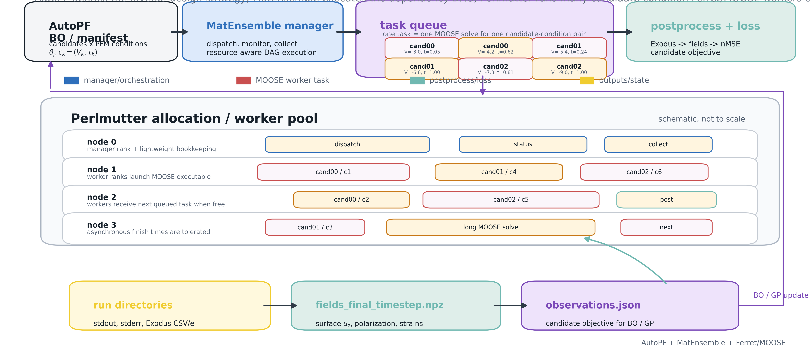
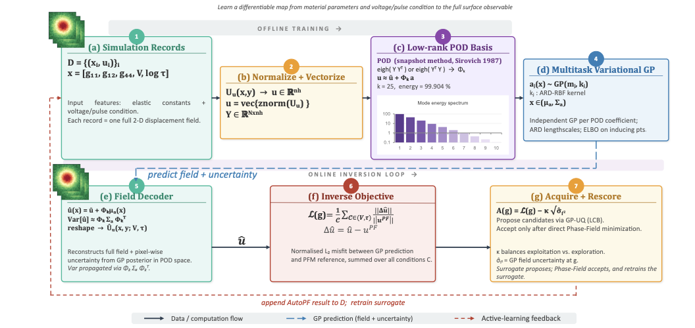

# AutoPF

**Automated high-throughput phase-field simulation campaigns with MOOSE and MatEnsemble.**

AutoPF is a lightweight Python interface for turning a calibrated MOOSE input file into a
reproducible ensemble of phase-field simulations. It is designed for scientific campaigns
where hundreds to thousands of parameterized MOOSE solves must be launched, tracked,
restarted, and mapped back to materials-model inputs.

<p align="center">
  
</p>

## Why AutoPF?

Phase-field studies often move beyond a single forward simulation:

- mobility and gradient-energy sweeps for Allen-Cahn and Cahn-Hilliard models
- sensitivity studies over interfacial energy, elastic, electrostatic, or kinetic parameters
- inverse-problem campaigns that compare simulated fields with experimental microscopy data
- active-learning or Bayesian-optimization loops where new simulations are proposed adaptively

AutoPF provides the orchestration layer for this workflow. MOOSE handles the physics,
MatEnsemble handles distributed task execution, and AutoPF keeps the scientific parameter
map close to the simulation outputs.

## What It Does

- Launches parameterized MOOSE jobs from Python.
- Assigns each simulation its own output directory.
- Supports per-job command-line arguments for MOOSE input overrides.
- Uses MatEnsemble restart files to recover task state.
- Maps completed, running, pending, and failed tasks back to directories and parameter values.
- Keeps the core API small enough to embed inside larger inverse-design or active-learning loops.

## Installation

```bash
git clone git@github.com:BagchiS6/AutoPF.git
cd AutoPF
pip install -e . --force-reinstall --no-deps
```

Requirements:

- Python `>=3.11`
- A compiled MOOSE application executable
- MatEnsemble installed in the active environment
- MPI/runtime modules compatible with the MOOSE executable

`matensemble` is intentionally not installed by `setup.py`; use the environment provided by
your computing site or install MatEnsemble separately.

## Quick Start

```python
from autopf.utils import automoose, read_job_stats

params = {
    "total_jobs": 100,
    "base_input": "AC.i",
    "arg_list": [
        ["Materials/consts/prop_values=0.1", "Kernels/ACInterface/kappa_name=0.1"],
        ["Materials/consts/prop_values=0.1", "Kernels/ACInterface/kappa_name=0.2"],
        # ...
    ],
    "num_cores": 4,
    "directory_list": [
        "output/AC_L_0.1_kappa_0.1",
        "output/AC_L_0.1_kappa_0.2",
        # ...
    ],
}

automoose("path/to/moose-app-opt", params)

job_stats = read_job_stats(
    dir_list=params["directory_list"],
    arg_list=params["arg_list"],
)
```

Each item in `arg_list` is passed to the MOOSE executable as command-line overrides.
Each matching entry in `directory_list` becomes the run directory for that simulation.

## Scientific Example: Allen-Cahn Sweep

The example in `examples/allen-cahn/` builds a 10 by 10 campaign over:

- `L`: Allen-Cahn mobility
- `kappa`: interfacial-gradient energy coefficient

The workflow creates 100 MOOSE tasks and organizes results as:

```text
output/AC_L_<L>_kappa_<kappa>/
```

Run the example workflow from the example directory:

```bash
cd examples/allen-cahn
matensemble-launch python demo_workflow.py
```

The workflow writes a timestamped `job_stats_*.json` file after reading the latest
MatEnsemble restart state.

## Featured Example: Low-Rank PFM Inversion

`examples/low-rank-PFM-inversion/` shows AutoPF in a full inverse-modeling loop:
MOOSE/Ferret campaigns generate surface displacement fields, POD/SVD compresses
the field ensemble, a condition-aware GP surrogate predicts `u_z(x, y)` across
voltage and pulse-width conditions, and active-learning proposals feed new
simulations back into AutoPF.

<p align="center">
  <a href="examples/low-rank-PFM-inversion/README.md">
    
  </a>
</p>

The example also includes a residual-guided hidden-physics study comparing
screening, flexo-proxy, and anisotropic eigenstrain hypotheses against PFM
holdout conditions.

## API Reference

### `automoose(mooseapp, params, write_restart_freq=10, buffer_time=0.5, adaptive_load_balance=True)`

Launch a MOOSE ensemble with MatEnsemble.

`params` fields:

- `total_jobs`: number of simulations
- `base_input`: MOOSE input file
- `arg_list`: list of per-job MOOSE command-line argument lists
- `num_cores`: cores assigned to each MOOSE job
- `directory_list`: optional output directory for each job

### `read_job_stats(stat_file=None, dir_list=None, arg_list=None)`

Read a MatEnsemble restart file and return task state. When `dir_list` or `arg_list`
is provided, AutoPF enriches each task entry with the corresponding output directory
and MOOSE parameter overrides.

### `get_latest_restart_file(directory=".")`

Find the highest-numbered `restart_*.dat` file in a directory.

## Examples

```text
examples/
  allen-cahn/                 Minimal high-throughput MOOSE campaign
  low-rank-PFM-inversion/     Low-rank PFM inverse-problem workflow
images/
  SI_fig_autopf_matensemble_scalable_orchestration.png
autopf/
  utils.py                    AutoPF launch and job-stat utilities
```

The low-rank PFM inversion example documents a larger scientific workflow where simulated
surface displacement fields are compressed with POD/SVD, modeled with Gaussian processes,
and compared against PFM-derived experimental targets.

## Interpreting Job State

`read_job_stats()` reports MatEnsemble task categories such as completed, running,
pending, and failed tasks. A MatEnsemble failure code does not always mean the MOOSE
physics solve produced unusable output. Inspect each job directory, especially `stdout`,
`stderr`, Exodus outputs, and postprocessor CSV files, before deciding whether a simulation
should be rerun.

## License

AutoPF is distributed under the MIT License. See `LICENSE` for details.
