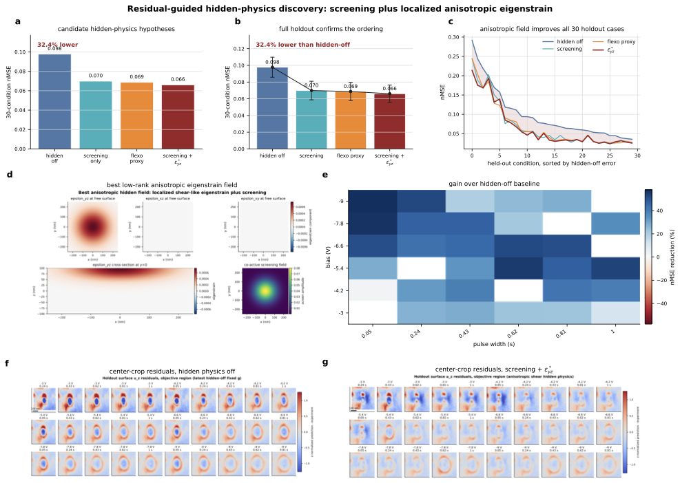

# Low-Rank PFM Inversion and Hidden-Physics Refinement

**A field-level inverse workflow for learning phase-field model parameters and
residual-guided hidden physics from PFM-derived surface response maps.**

This example shows how AutoPF can sit inside a larger scientific loop: launch
MOOSE/Ferret phase-field campaigns, collect full-field displacement outputs,
compress those fields with POD (Proper Orthogonal Decomposition) / SVD, train a
condition-aware surrogate, infer gradient-energy coefficients, and then refine
low-dimensional hidden-physics terms that explain the remaining structured
residuals.

<p align="center">
  
</p>

The first map learned by the workflow is the low-rank field surrogate:

```text
[g11, g12, g44, voltage, pulse_width] -> POD/SVD coefficients -> surface u_z(x, y)
```

That stage calibrates the cubic gradient-energy coefficients. The second stage
keeps the selected `g_ij` values fixed or tightly constrained and asks whether
additional hidden-physics controls reduce the PFM residuals:

```text
[g11, g12, g44, hidden physics, voltage, pulse_width] -> MOOSE/Ferret fields -> residual score
```

The hidden physics controls include screening, isotropic and anisotropic eigenstrain
proxies, spatial hidden fields, and flexo-proxy comparison terms.

## Scientific Motivation

PFM measurements provide spatially resolved information about electromechanical
response, but fitting a phase-field model directly to every pixel of every
condition is expensive. This example reduces the first part of the problem by
learning a low-rank representation of simulated surface fields. It then uses
the residual structure from that fit to design follow-up MOOSE campaigns for
hidden-physics refinement.

The workflow is useful for:

- calibrating gradient-energy coefficients `g11`, `g12`, and `g44`
- comparing simulated `u_z` or `disp_z` fields with experimental PFM targets
- proposing new MOOSE runs from a GP/POD active-learning loop
- testing whether residual structure points to missing physics
- refining scalar and spatial hidden-physics controls after the `g_ij` fit
- validating hidden-physics hypotheses such as localized screening,
  anisotropic eigenstrain, and flexo-proxy alternatives on holdout conditions

## Workflow

1. Build or collect MOOSE/Ferret simulation records across `g_ij` and
   voltage/pulse conditions.
2. Extract final surface displacement fields from the simulation outputs.
3. Normalize, vectorize, and compress the field ensemble with POD/SVD.
4. Train a surrogate from material and experimental-condition inputs to retained
   low-rank coefficients.
5. Decode predicted coefficients back into full-field `u_z(x, y)` maps with
   uncertainty estimates.
6. Score candidate `g_ij` values against the PFM targets and select a
   posterior-guided gradient-coefficient baseline.
7. Analyze the residuals left by the selected `g_ij` model.
8. Launch scalar hidden-physics anchors, spatial hidden-field pilots, and local
   trust-region refinement rounds with AutoPF.
9. Validate the best hidden-physics candidates on holdout voltage/pulse
   conditions and compare against hidden-off and flexo-proxy controls.

<p align="center">
  
</p>

The hidden-physics analysis is not a post-processing add-on; it is a second
campaign stage. After the gradient coefficients are selected, residuals are
used to build new MOOSE manifests that test scalar screening/eigenstrain,
localized spatial fields, anisotropic eigenstrain components, and flexo-proxy
competitors. In the representative study included here, localized screening
plus anisotropic eigenstrain reduced holdout error relative to the hidden-off
baseline.

## Directory Map

```text
.
|-- DATA_DICTIONARY.md
|-- docs/
|   |-- Figure_2_Low-Rank_field_Inversion_Workflow.pdf
|   |-- Figure_2_Low-Rank_field_Inversion_Workflow.png
|   |-- Figure3_hidden_physics_discovery.pdf
|   |-- Figure3_hidden_physics_discovery.png
|   |-- README_physical_bounds.md
|   `-- residual_hidden_physics_discovery_report.pdf
|-- moose_inputs/
|   `-- BTO_DW_anisotropic_hidden_physics_zdecay_ic.i
|-- surrogate_low_rank/
|   |-- train_uz_svd_surrogate.py
|   |-- train_uz_gp_surrogate.py
|   |-- propose_condition_gp_batch.py
|   `-- run_bo_loop.py
`-- workflows/
    |-- run_autopf_manifest.py
    |-- run_manifest_round.py
    `-- perlmutter_*.sh
```

## Main Components

### MOOSE Input

`moose_inputs/BTO_DW_anisotropic_hidden_physics_zdecay_ic.i` is the canonical
corrected-initial-condition input for the representative BTO domain-wall study.
Baseline runs are obtained by setting hidden-physics amplitudes to zero. The
same input can activate spatial screening, isotropic Vegard/eigenstrain,
anisotropic eigenstrain, and flexo-proxy comparison terms through command-line
parameters.

### AutoPF Campaigns

`workflows/run_autopf_manifest.py` translates a campaign manifest into an
AutoPF `automoose(...)` call. Each manifest run becomes one MOOSE job with
condition-specific arguments such as:

```text
tip_voltage=<V>
pulse_end=<tau>
g11=<value>
g12=<value>
g44=<value>
pfm_image_file=<target>
```

Hidden-physics refinement manifests add controls such as:

```text
screen_lambda=<value>
spatial_screen_amp=<value>
vegard_strain=<value>
spatial_vegard_amp=<value>
anis_vegard_yz_amp=<value>
flexo_proxy_amp=<value>
```

The included `perlmutter_*.sh` scripts are HPC launch templates. They contain
site-specific paths and should be adapted before running on a new system.

### Low-Rank Surrogates

`surrogate_low_rank/` contains the reduced-order modeling pieces:

- `train_uz_svd_surrogate.py`: builds the POD/SVD field basis
- `train_uz_gp_surrogate.py`: trains a variational multitask GP in SVD space
- `propose_condition_gp_batch.py`: proposes new candidate batches for active learning
- `make_latest_residual_svd_analysis.py`: evaluates residual structure after fitting

The condition-aware surrogate learns a map from gradient-energy parameters and
experimental condition to a low-rank field representation, then reconstructs
the full surface displacement field for scoring. Hidden-physics refinement is
handled as a follow-up MOOSE campaign driven by residual analysis, not as just
another unconstrained surrogate fit.

### Hidden-Physics Refinement

The hidden-physics stage starts after a corrected-IC or posterior-guided
`g_ij` point has been selected. The campaign pattern is:

- run an anchor round and dense inverse posterior for `g11`, `g12`, and `g44`
- analyze residual sensitivity to identify promising missing-physics families
- test scalar hidden terms such as `screen_lambda` and `vegard_strain`
- launch spatial pilots for localized screening and Vegard/eigenstrain fields
- refine local hidden-field amplitudes and widths in trust-region rounds
- compare anisotropic eigenstrain and flexo-proxy alternatives
- validate the best candidates on held-out voltage/pulse conditions

Representative final parameters and analysis products are documented in
`DATA_DICTIONARY.md`.

## Data Products

The expected data organization is documented in `DATA_DICTIONARY.md`. Important
artifact groups include:

- experimental PFM target grids named by voltage and pulse width
- baseline inverse-posterior tables over `g11`, `g12`, and `g44`
- POD/SVD preprocessing arrays and retained basis information
- trained GPyTorch surrogate states
- active-learning proposal JSON files
- residual-sensitivity summaries used to seed hidden-physics refinement
- scalar, spatial, anisotropic, and flexo-proxy hidden-physics rankings
- hidden-physics holdout rankings and residual diagnostics
- final anisotropic relaxation outputs and postprocessor CSV files

Large simulation outputs and trained artifacts are not assumed to be present in
every source checkout. The repository keeps the workflow code, documentation,
and representative inputs needed to reproduce or extend the campaign.

## Typical Usage Pattern

These commands assume a staged campaign environment with the required PFM
targets, post-processing helpers, MOOSE/Ferret executable paths, and scheduler
settings already adapted for the target HPC system.

From this example directory:

```bash
cd examples/low-rank-PFM-inversion
```

Inspect or adapt the campaign configuration:

```bash
less workflows/sim_bo_config.json
```

Run a prepared manifest through AutoPF and score it:

```bash
python workflows/run_manifest_round.py --manifest path/to/manifest.json
```

For already completed simulations, score without relaunching MOOSE:

```bash
python workflows/run_manifest_round.py --manifest path/to/manifest.json --score-only
```

Train or update the low-rank surrogate from available field data:

```bash
python surrogate_low_rank/train_uz_svd_surrogate.py --help
python surrogate_low_rank/train_uz_gp_surrogate.py --help
```

Generate an active-learning proposal batch:

```bash
python surrogate_low_rank/propose_condition_gp_batch.py --help
```

Run a staged posterior-guided hidden-physics refinement campaign:

```bash
./workflows/perlmutter_corrected_ic_posterior_guided_campaign.sh
```

That script represents the full second-stage campaign pattern: gradient
coefficient anchor, dense posterior, residual-sensitivity analysis, scalar
hidden terms, spatial refinement, holdout validation, and report generation.

## Reading the Figures

- `docs/Figure_2_Low-Rank_field_Inversion_Workflow.pdf`: full workflow from
  simulation records through POD/SVD, GP prediction, inverse scoring, and
  AutoPF feedback.
- `docs/Figure3_hidden_physics_discovery.pdf`: residual-guided comparison of
  hidden-off, screening-only, flexo-proxy, and screening-plus-anisotropic
  eigenstrain hypotheses.
- `docs/residual_hidden_physics_discovery_report.pdf`: detailed analysis report
  for the residual-guided hidden-physics workflow.

## Notes

This example is intentionally more research-workflow oriented than the compact
Allen-Cahn example. It mixes AutoPF orchestration, MOOSE/Ferret physics inputs,
field post-processing, reduced-order modeling, and active learning. Treat the
scripts as a reproducible campaign scaffold: update executable paths, data
locations, scheduler settings, and result-transfer settings for your computing
environment before launching new runs.
